# 알고리즘_1DAY

* 시간복잡도
  
  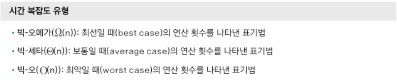
  
  * 빅-오로 계산
  
  * 1초 == 2000만 번
  
  * (BOJ 2750) 수 정렬하기
    
    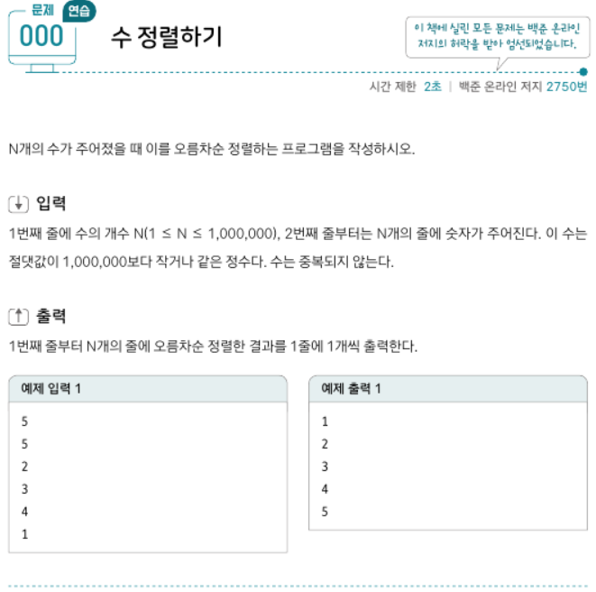
    
    * 버블정렬은 n2이므로 1백만**2 > 4천만
      
      * 부적합
    
    * 병합정렬은 nlogn 이므로 1백만log1백만 == 2천만 < 4천만
      
      * 적합
  
  * N == 3N 은 N으로 동일하다. 시간 낭비 하지말자

* 배열과 리스트
  
  * 파이썬에선 구분안한다
  
  * (BOJ 11720) 숫자의 합 구하기
    
    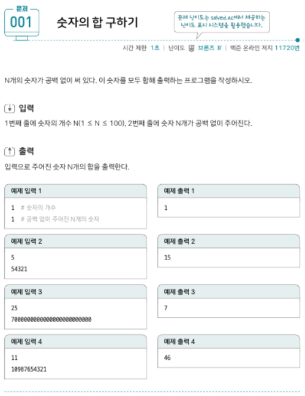
    
    
  
  * (BOJ 1546) 평균 구하기
    
    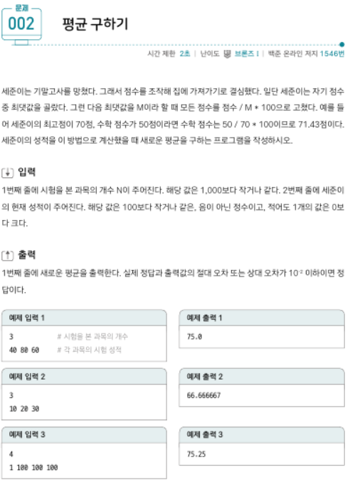
    
    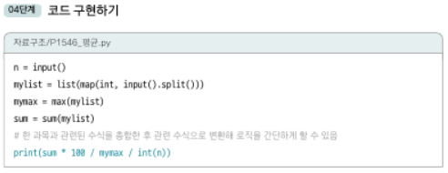

* 구간 합
  
  * 합 배열을 이용한 시간 복잡도 줄이기 위한 특수한 목적의 알고리즘!!! 중요하다
    
    * 합 배열
      
      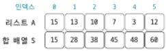
      
      * S[i] = S[i-1] + A[i]
      
      * 구간 합으로 사용 법 : S[j] - S[i-1]
  
  * (BOJ 11659) 구간 합 구하기 1
    
    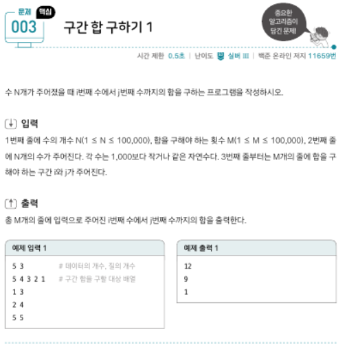
    
    - 10만*10만은 0.5초로 턱없이 부족하니 구간 합 사용
    
    - 합 배열을 만들어 모든 경우 적용
    
    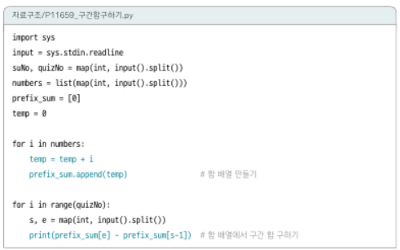
  
  * (BOJ 11660) 구간 합 구하기 2
    
    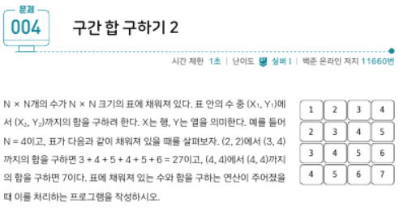
    
    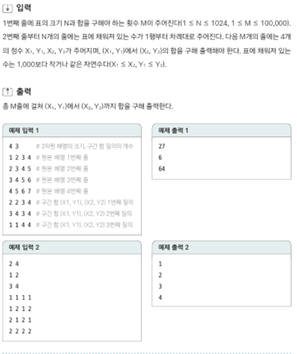
    
    * 1000 * 1000 * 10만이므로 1초 무리니 구간 합 사용
    
    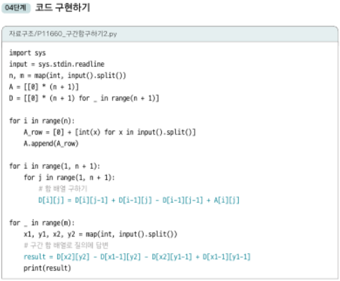
  
  * (BOJ 10986) 나머지 합 구하기
    
    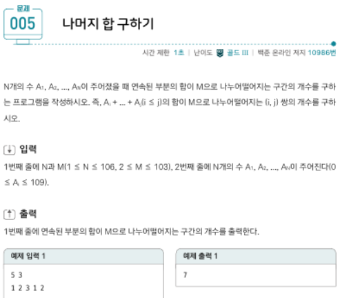
    
    - 문제 오류있음,, 106이 아니라 10**6 승임
    
    - 너무 값이 크므로 배열 합을 이용해 구간 합 일일히 구하면 시간초과 100퍼센트 해결법은 참신하게 풀기
      
      - 배열 합 M으로 나누어 최신화 하고, 같은 숫자 조합으로 갯수
    
    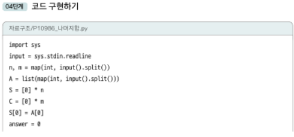
    
    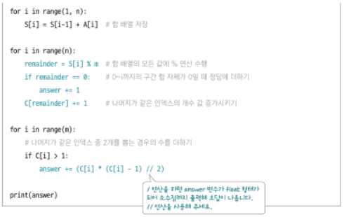
