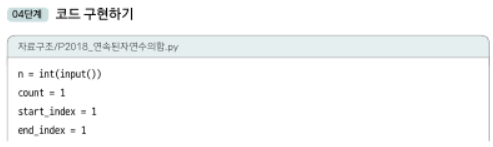
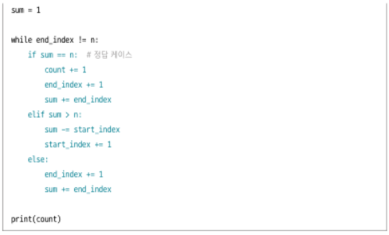
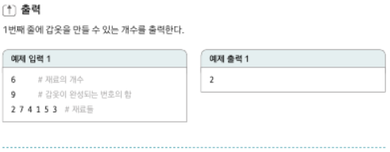
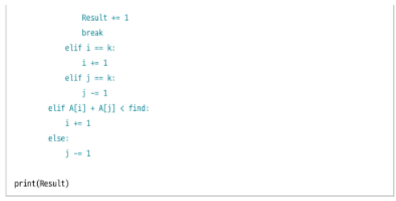

# 알고리즘_2DAY

* 투 포인터
  
  * 개인적으로 해깔림,, 암기, 반복하자
  
  * (BOJ 2018) 연속된 자연수의 합 구하기
    
    
    
    * 2초니 4천만 but 천만log천만은 너무 큼
    
    * O(n) 으로 끝내야한다 -> 투포인터
    
    
    
    
  
  * (BOJ 1940) 주몽의 명령 
    
    
    
    
    
    * 이중 for 로 하면 백퍼 시간초과
    
    * 정렬로 해서 투포인터 하기
    
    * 위의 문제와 비교하자면, 투포인터 값들 사이에 값을 다 더해서 가는거라 start_index의 이동은 빼기 효과인 반면, 이 문제는 이동 시 무조건 증가 그래서 양쪽에 투포인터를 두어 접근하면 왼쪽은 증가효과, 오른쪽은 감소효과
      
      * 투포인터는 먼가 감소효과, 증가효과 둘 다 있어야 하는 상황 -> 내가 포인터를 잘 잡아야함
    
    
  
  * (BOJ 1253) '좋은 수' 구하기
    
    
    
    * 이중 for하고 존재유무 확인하면 N**3 나와서 안됨
    
    * 정렬 후 양 끝단에서 투포인터 접근 후 구하지면 다시 첨부터 조사
    
    
    
    
