# 알고리즘_3DAY

* 슬라이딩 윈도우
  
  * 2개의 포인터로 범위 지정 후, 범위 유지한 채 이동하며 문제 해결
  
  * (BOJ 12891) DNA 비밀번호
    
    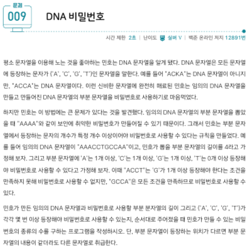
    
    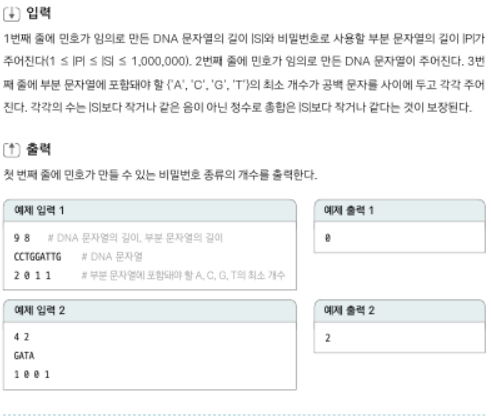
    
    * O(n) 으로 풀기 위해, 고정된 범위 하나씩 이동하면 체크리스트 비교
    
    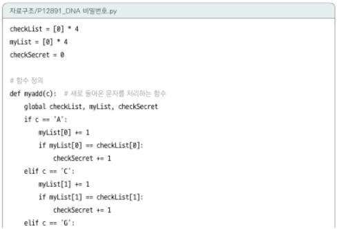
    
    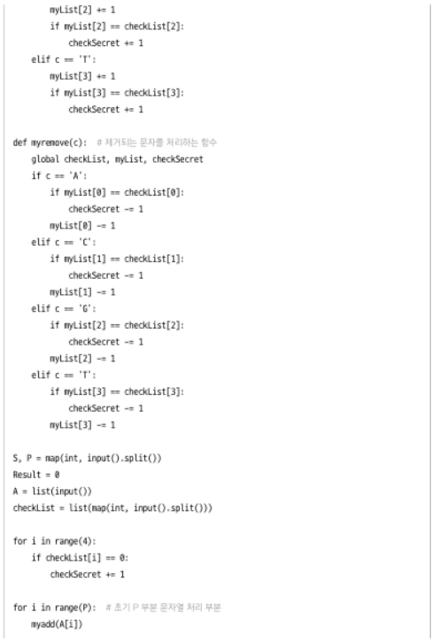
    
    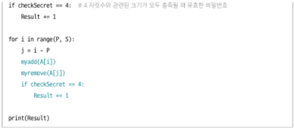
  
  * (BOJ 11003) 최솟값 찾기 1
    
    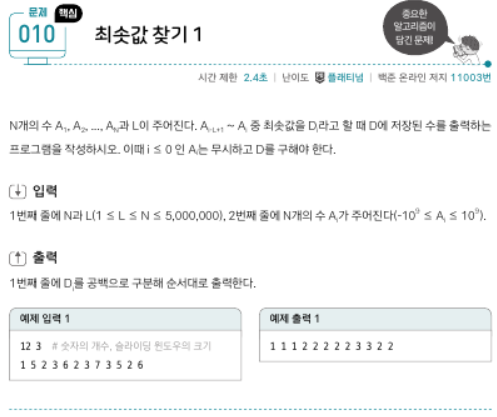
    
    * O(nlogn) 도 안되므로,  슬라이딩 윈도우와 덱으로 O(n) 접근
    * 빈 덱에, 인덱스와 값을 튜플로 넣어주기
    
    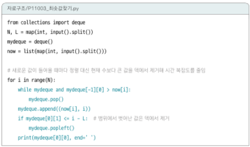

* 스택과 큐
  
  * (BOJ 1874) 스택으로 수열 만들기
    
    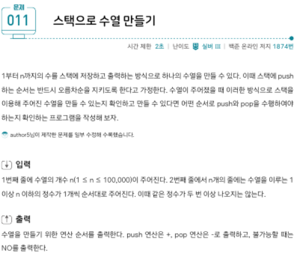
    
    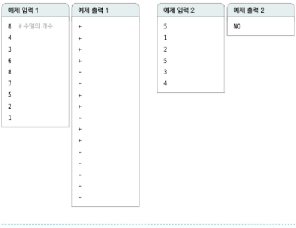
    
    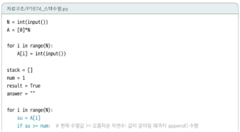
    
    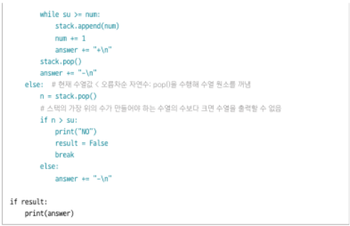
